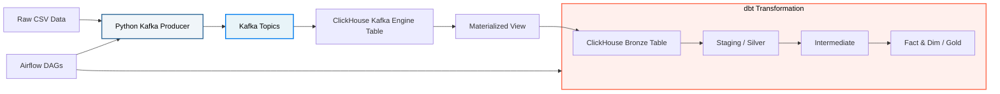

  🌐 <strong><a href="README.md">🇬🇧 English</a></strong> | <strong><a href="README_th.md">🇹🇭 ภาษาไทย</a></strong>

# Streamify Data Pipeline Project (Streaming Edition)

This project is a **Modern Real-Time Streaming Data Pipeline** designed for analyzing music streaming behavior from a simulated platform (Streamify). It leverages best-in-class tools, including `Kafka`, `ClickHouse`, `dbt`, and `Airflow`, to handle real-time ingestion, Data Modeling, and pipeline orchestration.

> **Note:** 
> * The structure of this Project was originally a batch-processing pipeline, but it has been completely upgraded into a real-time streaming architecture.
> * The data used in this Project is from **[Streamify](https://github.com/ankurchavda/streamify)**, which simulates mock data and is stored in `data/`.

## Project Setup

For instructions on how to set up and run this project locally, please refer to the **[Project Setup Guide](setup-project.md)**.
For a deep-dive into how we migrated from Batch to Streaming, check out the **[Kafka Integration Plan](kafka_integration_plan.md)**!

## Workflow of this project

---

## Project Structure

### 1. `data/` (Raw Data)
Folder for storing raw data files generated from the simulator.
- **Note:** Large data files will not be pushed to Git (configured in `.gitignore`).
- Only the `_sample.csv` files, limited to **200 rows**, are included for basic system testing.

### 2. `kafka/` (Python Data Producer)
Folder containing scripts to simulate the live streaming events.
- **`producer/kafka_producer.py`**: A custom Python script that reads static CSVs and streams them row-by-row into Kafka topics, formatting timestamps and nulls properly for strict JSON parsers.

### 3. `services/` (Infrastructure & Metadata)
Helper scripts for generating data warehouse infrastructure.
- **`metadata/ddl_generator.py`**: A helper script that automates the generation of ClickHouse infrastructure (MergeTree tables, Kafka Engine tables, and Materialized Views) based on YAML configurations.

### 4. `dbt/streamify/` (Data Transformation)
This layer uses **dbt** to clean and transform the streaming data, divided into 3 main sub-layers:

- **`models/staging/`** *(Silver Layer)*
  - **Files:** `stg_streamify__listen_events`, `stg_streamify__auth_events`
  - **Role:** Cleans raw streaming data, fixes null values, and strictly handles **deduplication** (removing duplicate events generated by the Kafka stream).

- **`models/intermediate/`** *(OBT)*
  - **Files:** `int_streamify__listen_events`
  - **Role:** Handles complex window functions (like grabbing the most recent user subscription level) using `ROW_NUMBER()`.

- **`models/core/`** *(Gold Layer - Star Schema)*
  - **Role:** Breaks down tables into **Dimensions** to describe data attributes, and **Facts** to store transactional metrics.
  - **Key Files:** 
    - `fct_streamify__listen_events` *(Listening Fact table)*
    - `dim_streamify__users`, `dim_streamify__contents`, `dim_streamify__date` *(Dimensions)*

### 4. `airflow/` (Data Orchestration)
Folder for managing Workflows and Scheduling the Data Pipeline.
- **`dags/`**: 
  - `init_platform.py`: A utility DAG that generates the ClickHouse DDL commands (MergeTree, Kafka Engine, and Materialized Views) based on our dataset YAML configurations.
  - `simulate_stream.py`: A DAG with a BashOperator that triggers our Python Producer to start streaming data into Kafka. *(**Note:** In a real-world production environment, Kafka Producers are standalone backend applications. We use Airflow to trigger it here purely as a convenient UI to run our simulation for studying/testing).*
  - `streamify_dbt_process.py`: A DAG running on a Time-Based (Cron) schedule that tells dbt to continually process the newest streaming data and update the dashboards.

---

## Business Scenario Simulation

Since this project was created to practice building a Data Pipeline, I prompted AI to assume different roles involved in a data project (Data Source Owner, Business Analyst, CEO) to simulate a realistic working environment.

You can view the Business Questions derived from this simulation here: <strong><a href="dbt/streamify/models/bussiness_question.md">Business Questions</a></strong>

___

## Project Summary & Reflection

**Dashboard public link:** [Streamify Dashboard](https://datastudio.google.com/reporting/107e96a5-47d7-406b-bc8d-01d3cba74cc9)

### What did I learn from upgrading this project to Streaming?
- **Kafka & Real-Time Ingestion:** Learned how to stream data using producers, manage Kafka topics, and ingest data automatically using ClickHouse's native Kafka Table Engine.
- **Docker Networking & DevOps:** Learned how to bake dependencies (`confluent-kafka`) into custom Docker images using `requirements.txt` and how containers communicate internally.
- **Data Engineering Debugging:** Gained real-world experience debugging strict schema parsers (handling Python `NaN` vs JSON `null`) and fixing the famous Kafka **"Poison Pill"** offset problem.
- **Idempotency & Deduplication:** Learned the pros and cons of using ClickHouse's `ReplacingMergeTree` engine versus handling data deduplication inside the dbt Staging layer using `DISTINCT` or `ROW_NUMBER()`.
- **Airflow Orchestration:** Successfully transitioned Airflow from waiting on batch ingestion tasks (Data-Aware scheduling) to using Cron-based scheduling to continually update streaming models.

### How would you improve it?
- Implement **dbt incremental models** to only process the newest streaming data rather than rebuilding the entire Fact table on every run.
- Add **dbt tests** (Data Quality) to monitor the live streaming data for anomalies (like negative song durations).
- Implement PySpark Structured Streaming for more complex upstream transformations before data hits ClickHouse.
