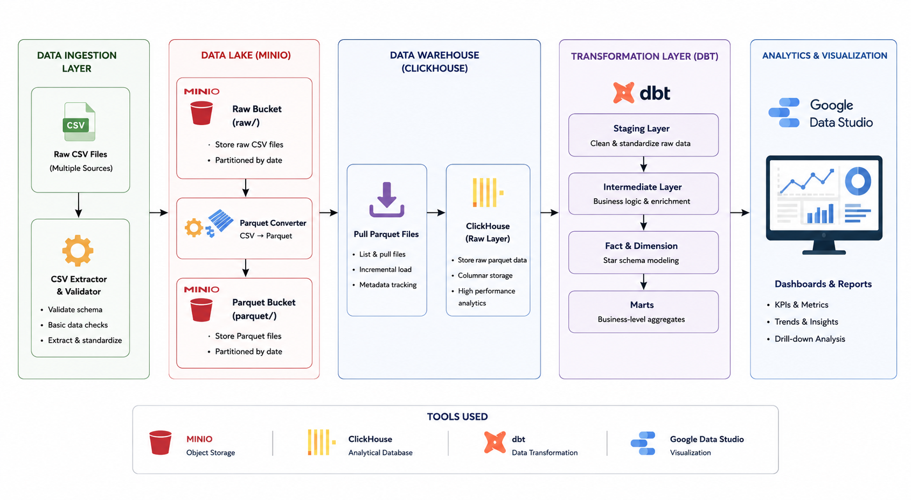
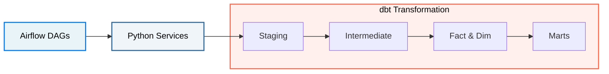

  🌐 <strong><a href="README.md">🇬🇧 English</a></strong> | <strong><a href="README_th.md">🇹🇭 ภาษาไทย</a></strong>

# Streamify Data Pipeline Project

This project is a Data Pipeline designed for analyzing music streaming behavior from a simulated platform (Streamify). It leverages the **Modern Data Stack**, including `dbt`, `ClickHouse`, and `Airflow`, to handle Data Modeling and Pipeline orchestration.

> **Note:** 
> * The structure of this Project was cloned from a Github Repo I previously created, and then adapted and enhanced from its original version.
> * The data used in this Project is from **[Streamify](https://github.com/ankurchavda/ 
)**, which simulates and extracts mock data for a specific point in time and is stored in `data/`.

## System Architecture

## Pipeline Workflow

---

## Project Structure

### 1. `data/` (Raw Data)
Folder for storing raw data files generated from the simulator.
- **Note:** Large data files will not be pushed to Git (configured in `.gitignore`).
- Only the `_sample.csv` files, limited to **200 rows**, are included for basic system testing.

### 2. `services/` (Python Data Ingestion)
Python scripts for importing and processing files before loading them into the Data Warehouse.
- **`extractors/csv_extractor.py`**: Helps in reading CSV files.
- **`converters/parquet_converter.py`**: Converts files from Raw CSV to Parquet Format.
- **`metadata/ddl_generator.py`**: Helper script to extract data structure (Schema) into DDL commands for creating tables in ClickHouse.

### 3. `dbt/streamify/` (Data Transformation)
This layer is divided into 3 main sub-layers:

- **`models/staging/`** *(Cleansing Layer)*
  - **Files:** `stg_streamify__listen_events`, `stg_streamify__auth_events`, `stg_streamify__page_view_events`

- **`models/intermediate/`** *(OBT)*
  - **Files:** `int_streamify__listen_events`

- **`models/core/`** *(Star Schema)*
  - **Role:** Breaks down tables from Intermediate into **Dimensions** to describe data attributes, and **Facts** to store transactional metrics.
  - **Key Files:** 
    - `fct_streamify__listen_events` *(Listening Fact table)*
    - `dim_streamify__users`, `dim_streamify__contents`, `dim_streamify__date` *(Various Dimension tables)*

### 4. `airflow/` (Data Orchestration)
Folder for managing Workflows and Scheduling the Data Pipeline.
- **`dags/`**: Folder for storing DAG (Directed Acyclic Graph) files, which define the execution order of the pipeline steps (e.g., triggering Python scripts for data ingestion, followed by executing `dbt run`).
- **`config/datasets/`**: Stores configuration and metadata files related to datasets, allowing Airflow to systematically reference and manage data.

---

## Business Scenario Simulation

Since this project was created to practice building a Data Pipeline and developing skills as a Data Engineer, I wanted to reflect the reality that Data Engineers must communicate and collaborate with various stakeholders, such as Data Owners, Business Analysts (BAs), Data Scientists, and Executives.

Therefore, to simulate a realistic working environment, I prompted AI to assume different roles involved in a data project:
- **Data Source Owner**
- **Business Analyst (BA)**
- **CEO**

You can view the Business Questions derived from this simulation here: <strong><a href="dbt/streamify/models/bussiness_question.md">Business Questions</a></strong>
