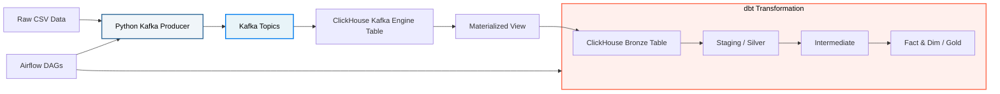

  🌐 <strong><a href="README.md">🇬🇧 English</a></strong> | <strong><a href="README_th.md">🇹🇭 ภาษาไทย</a></strong>

# Streamify Data Pipeline Project (Streaming Edition)

โปรเจคนี้เป็นระบบ **Modern Real-Time Streaming Data Pipeline** สำหรับวิเคราะห์ข้อมูลพฤติกรรมการฟังเพลงจากแพลตฟอร์มจำลอง (Streamify) โดยมีการประยุกต์ใช้เครื่องมือระดับองค์กร ได้แก่ `Kafka`, `ClickHouse`, `dbt`, และ `Airflow` ในการรับส่งข้อมูลแบบเรียลไทม์, ทำ Data Modeling, และทำ Pipeline Orchestration

> **หมายเหตุ:** 
> * โครงสร้างเดิมของ Project นี้เป็นแบบ Batch Processing แต่ได้รับการอัปเกรดใหม่ทั้งหมดให้เป็นระบบ Real-time Streaming
> * ข้อมูลที่ใช้ใน Project นี้เป็นข้อมูลจาก **[Streamify](https://github.com/ankurchavda/streamify)** ซึ่งจะดึงข้อมูลจำลองมา และถูกจัดเก็บใน `data/`

## Project Setup (การติดตั้งและตั้งค่าโปรเจค)

สำหรับขั้นตอนการติดตั้งและรันโปรเจคนี้บนเครื่องของคุณ สามารถดูได้ที่ **[คู่มือการตั้งค่าโปรเจค (Project Setup Guide)](setup-project.md)**
สำหรับรายละเอียดเจาะลึกว่าเราย้ายจากระบบ Batch มาเป็น Streaming ได้อย่างไร สามารถดูได้ที่ **[Kafka Integration Plan](kafka_integration_plan.md)**!

## System Architecture (The Medallion Architecture)

---

## Project Structure (โครงสร้างโปรเจค)

### 1. `data/` (ข้อมูลดิบ)
โฟลเดอร์สำหรับจัดเก็บไฟล์ข้อมูลดิบ (Raw Data) ที่ถูกจำลองขึ้นมา
- **Note:** ไฟล์ข้อมูลขนาดใหญ่จะไม่ถูกนำขึ้น Git (ถูกกำหนดไว้ใน `.gitignore`) 
- จะมีเพียงไฟล์ `_sample.csv` ที่จำกัด **200 แถว** สำหรับใช้ทดสอบรันระบบเบื้องต้นเท่านั้น

### 2. `kafka/` (Python Data Producer)
โฟลเดอร์ที่เก็บสคริปต์สำหรับจำลองการส่งข้อมูล (Streaming) แบบสดๆ
- **`producer/kafka_producer.py`**: สคริปต์ Python ที่ทำหน้าที่อ่านไฟล์ CSV และส่งข้อมูลทีละแถวเข้าสู่ Kafka Topics พร้อมปรับรูปแบบวันที่และค่า Null ให้ถูกต้องเพื่อรองรับการ Parsing JSON แบบเข้มงวด

### 3. `services/` (Infrastructure & Metadata)
ชุดคำสั่งสำหรับสร้าง Data Warehouse Infrastructure
- **`metadata/ddl_generator.py`**: ตัวช่วยสร้างสคริปต์อัตโนมัติในการสร้างตารางและสถาปัตยกรรมต่างๆ ใน ClickHouse (MergeTree tables, Kafka Engine tables, และ Materialized Views) โดยอิงตาม YAML Config

### 4. `dbt/streamify/` (Data Transformation)
การทำงานในส่วนนี้ใช้ **dbt** ในการทำความสะอาดและแปลงข้อมูล Streaming โดยแบ่งออกเป็น 3 ชั้น (Layers) หลักๆ:

- **`models/staging/`** *(Silver Layer)*
  - **Files:** `stg_streamify__listen_events`, `stg_streamify__auth_events`
  - **หน้าที่:** ทำความสะอาดข้อมูล Streaming, จัดการค่า Null, และ **ทำ Deduplication** เพื่อลบข้อมูลซ้ำซ้อนที่อาจเกิดจากการ Stream เข้ามา

- **`models/intermediate/`** *(OBT)*
  - **Files:** `int_streamify__listen_events`
  - **หน้าที่:** จัดการ Window Functions ที่ซับซ้อน (เช่น ดึงระดับสมาชิกผู้ใช้ล่าสุด) ด้วย `ROW_NUMBER()`

- **`models/core/`** *(Gold Layer - Star Schema)*
  - **หน้าที่:** แตกตารางแยกเป็น **Dimension** เพื่ออธิบายข้อมูล และ **Fact** เพื่อเก็บตัวเลขการกระทำ
  - **ไฟล์สำคัญ:** 
    - `fct_streamify__listen_events` *(Fact การฟังเพลง)*
    - `dim_streamify__users`, `dim_streamify__contents`, `dim_streamify__date` *(Dimension ต่างๆ)*

### 5. `airflow/` (Data Orchestration)
โฟลเดอร์สำหรับจัดการ Workflow และตั้งเวลาการทำงาน (Scheduling) ของ Data Pipeline
- **`dags/`**: 
  - `init_platform.py`: ยูทิลิตี้ DAG ที่ใช้สร้างคำสั่ง DDL ของ ClickHouse (ตาราง MergeTree, Kafka Engine, และ Materialized Views) โดยอิงตามการตั้งค่าจากไฟล์ YAML
  - `simulate_stream.py`: DAG ที่ใช้ BashOperator เพื่อสั่งรัน Python Producer ให้เริ่มทำการจำลองการส่งข้อมูลเข้า Kafka 
    *(**หมายเหตุ:** ในโลกของการทำงานจริง (Production) Kafka Producer จะเป็นแอปพลิเคชัน Backend ที่แยกออกไปต่างหาก การที่เราใช้ Airflow เป็นตัวสั่งรันที่นี่ เป็นเพียงเพื่อความสะดวกในการใช้ UI จำลองการทำงานเพื่อการศึกษาและทดสอบเท่านั้น)*
  - `streamify_dbt_process.py`: DAG ที่ทำงานบนตารางเวลา (Cron) แบบอิงเวลา เพื่อสั่งให้ dbt ทำการประมวลผลข้อมูล Streaming ใหม่ล่าสุดและอัปเดตหน้า Dashboard อย่างต่อเนื่อง

---

## การจำลองสถานการณ์ทางธุรกิจ (Business Scenario Simulation)

เนื่องจากโปรเจคนี้จัดทำขึ้นเพื่อฝึกฝนการสร้าง Data Pipeline ผมจึงได้ทำการ Prompt AI เพื่อจำลองบทบาทต่างๆ ในโปรเจค (Data Owner, BA, CEO) เพื่อให้เห็นภาพการทำงานที่ใกล้เคียงกับความเป็นจริงมากที่สุด

สามารถดูรายละเอียดคำถามทางธุรกิจที่ได้จากการจำลองสถานการณ์นี้ได้ที่: <strong><a href="dbt/streamify/models/bussiness_question.md">Business Questions</a></strong>
___

## บทสรุปและสิ่งที่ได้เรียนรู้

**ลิงก์ Dashboard:** [Streamify Dashboard](https://datastudio.google.com/reporting/107e96a5-47d7-406b-bc8d-01d3cba74cc9)

### สิ่งที่ได้เรียนรู้จากการอัปเกรดระบบเป็น Streaming
- **Kafka & Real-Time Ingestion:** ได้เรียนรู้วิธีการสตรีมข้อมูลด้วย Producer, จัดการ Kafka Topic, และการนำเข้าข้อมูลแบบอัตโนมัติโดยใช้ Kafka Table Engine ที่เป็น Native ของ ClickHouse
- **Docker Networking & DevOps:** ได้เรียนรู้การจัดการ Dependency (เช่น `confluent-kafka`) เข้าไปใน Docker Image ด้วย `requirements.txt` และเข้าใจการทำงานของ Container Network
- **Data Engineering Debugging:** ได้ประสบการณ์จริงในการแก้ปัญหา Parsing แบบเข้มงวดของ ClickHouse (เช่น การจัดการ `NaN` ของ Python เทียบกับ `null` ของ JSON) และวิธีแก้ปัญหา **"Poison Pill"** (ข้อมูลพังที่ติดอยู่ในคิวของ Kafka)
- **Idempotency & Deduplication:** ได้เรียนรู้ข้อดีข้อเสียระหว่างการใช้ฟีเจอร์ `ReplacingMergeTree` ของ ClickHouse กับการทำ Deduplication ผ่าน dbt Staging ด้วย `DISTINCT` หรือ `ROW_NUMBER()`
- **Airflow Orchestration:** ประสบความสำเร็จในการปรับเปลี่ยน Airflow จากเดิมที่ต้องรอ Batch การโหลดข้อมูล (Data-Aware Scheduling) มาเป็นการตั้งเวลาแบบ Cron เพื่ออัปเดตข้อมูล Streaming เข้าสู่โมเดลต่างๆ 

### แนวทางการพัฒนาต่อยอด
- ลองใช้งาน **dbt incremental models** เพื่อประมวลผลเฉพาะข้อมูลที่เข้ามาใหม่ แทนการคำนวณ Fact Table ใหม่ทั้งหมดทุกครั้ง
- เพิ่ม **dbt tests** (Data Quality) เพื่อเอนชัวร์ความถูกต้องของข้อมูลสตรีมแบบเรียลไทม์ (เช่น เช็คว่าเพลงต้องมีความยาวไม่ติดลบ)
- นำ PySpark Structured Streaming เข้ามาใช้สำหรับการทำ Transformation ขั้นซับซ้อนก่อนที่ข้อมูลจะไปถึง ClickHouse
