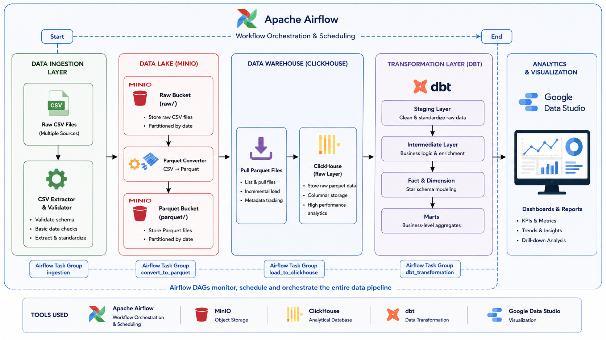
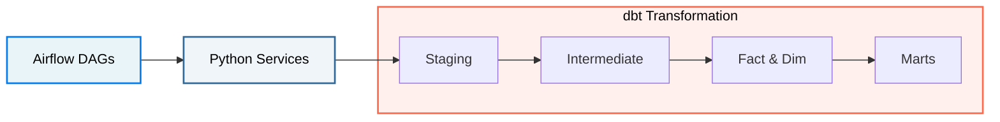
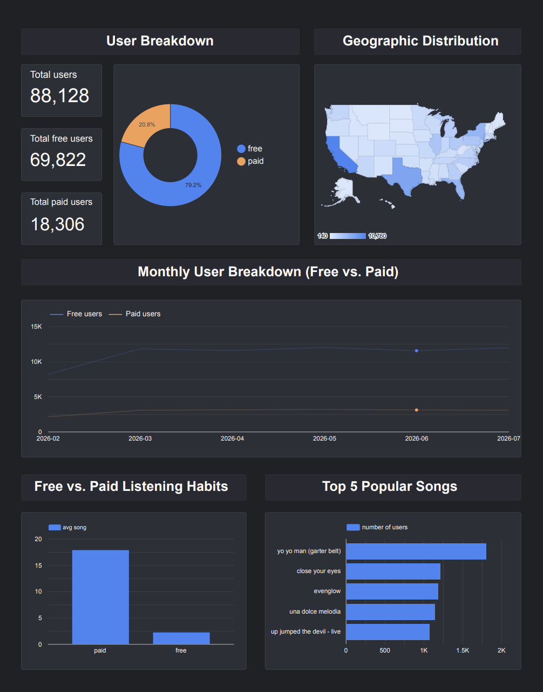

  🌐 <strong><a href="README.md">🇬🇧 English</a></strong> | <strong><a href="README_th.md">🇹🇭 ภาษาไทย</a></strong>

# Streamify Data Pipeline Project

โปรเจคนี้เป็นระบบ Data Pipeline สำหรับวิเคราะห์ข้อมูลพฤติกรรมการฟังเพลงจากแพลตฟอร์มจำลอง (Streamify) โดยมีการประยุกต์ใช้ **Modern Data Stack** อย่าง `dbt`, `ClickHouse` และ `Airflow` ในการทำ Data Modeling และทำ Pipeline

> **หมายเหตุ:** 
> * โครงสร้างของ Project นี้ได้มีการ Clone มาจาก Github Repo ที่เป็น Structure ที่ผมได้เคยทำไว้ และนำมาปรับและต่อยอดจากของเดิม
> * ข้อมูลที่ใช้ใน Project นี้เป็นข้อมูลจาก **[Streamify](https://github.com/ankurchavda/streamify)** ซึ่งจะดึงข้อมูลจำลองมา ณ ช่วงเวลาใดเวลานึงเพียงเท่านั้น และจะถูกจัดเก็บใน `data/`

## Project Setup (การติดตั้งและตั้งค่าโปรเจค)

สำหรับขั้นตอนการติดตั้งและรันโปรเจคนี้บนเครื่องของคุณ สามารถดูได้ที่ **[คู่มือการตั้งค่าโปรเจค (Project Setup Guide)](setup-project.md)**

## System Architecture

## Pipeline Workflow

---

## Project Structure (โครงสร้างโปรเจค)

### 1. `data/` (ข้อมูลดิบ)
โฟลเดอร์สำหรับจัดเก็บไฟล์ข้อมูลดิบ (Raw Data) ที่ถูกจำลองขึ้นมา
- **Note:** ไฟล์ข้อมูลขนาดใหญ่จะไม่ถูกนำขึ้น Git (ถูกกำหนดไว้ใน `.gitignore`) 
- จะมีเพียงไฟล์ `_sample.csv` ที่จำกัด **200 แถว** สำหรับใช้ทดสอบรันระบบเบื้องต้นเท่านั้น

### 2. `services/` (Python Data Ingestion)
ชุดคำสั่ง Python สำหรับนำเข้าและจัดการไฟล์ก่อนส่งเข้า Data Warehouse
- **`extractors/csv_extractor.py`**: ช่วยในการอ่านไฟล์ CSV 
- **`converters/parquet_converter.py`**: แปลงไฟล์จาก Raw CSV ให้เป็น Parquet Format 
- **`metadata/ddl_generator.py`**: ตัวช่วยแกะโครงสร้างข้อมูล (Schema) ออกมาเป็นคำสั่ง DDL เพื่อสร้างตารางใน ClickHouse

### 3. `dbt/streamify/` (Data Transformation)
การทำงานในส่วนนี้ถูกแบ่งออกเป็น 3 ชั้น (Layers) หลักๆ:

- **`models/staging/`** *(ชั้นทำความสะอาด)*
  - **Files:** `stg_streamify__listen_events`, `stg_streamify__auth_events`, `stg_streamify__page_view_events`

- **`models/intermediate/`** *(OBT)*
  - **Files:** `int_streamify__listen_events`

- **`models/core/`** *(Star Schema)*
  - **หน้าที่:** แตกตารางออกจาก Intermediate แยกเป็น **Dimension (ตารางมิติ)** เพื่ออธิบายข้อมูล และ **Fact (ตารางเหตุการณ์)** เพื่อเก็บตัวเลขการกระทำ
  - **ไฟล์สำคัญ:** 
    - `fct_streamify__listen_events` *(Fact การฟังเพลง)*
    - `dim_streamify__users`, `dim_streamify__contents`, `dim_streamify__date` *(Dimension ต่างๆ)*

### 4. `airflow/` (Data Orchestration)
โฟลเดอร์สำหรับจัดการ Workflow และตั้งเวลาการทำงาน (Scheduling) ของ Data Pipeline
- **`dags/`**: โฟลเดอร์สำหรับเก็บไฟล์ DAG (Directed Acyclic Graph) ซึ่งใช้กำหนดลำดับขั้นตอนการทำงานของ Pipeline เช่น สั่งรัน Python Script เพื่อนำเข้าข้อมูล แล้วตามด้วยการสั่ง `dbt run`
- **`config/datasets/`**: จัดเก็บไฟล์การตั้งค่า (Config/Metadata) ที่เกี่ยวข้องกับชุดข้อมูล เพื่อให้ Airflow สามารถอ้างอิงและจัดการข้อมูลได้อย่างเป็นระบบ

---

## การจำลองสถานการณ์ทางธุรกิจ (Business Scenario Simulation)

เนื่องจากโปรเจคนี้จัดทำขึ้นเพื่อฝึกฝนการสร้าง Data Pipeline และพัฒนาทักษะในสายงาน Data Engineer แต่ในโลกของการทำงานจริงนั้น Data Engineer จำเป็นต้องมีการสื่อสารและทำงานร่วมกับหลายฝ่าย เช่น Data Owner, Business Analyst (BA), Data Scientist และผู้บริหาร

ดังนั้น เพื่อให้เห็นภาพการทำงานที่ใกล้เคียงกับความเป็นจริงมากที่สุด ผมจึงได้ทำการ Prompt AI เพื่อจำลองบทบาท (Roles) ต่างๆ ที่เกี่ยวข้อง ดังนี้:
- **Data Source Owner**
- **Business Analyst (BA)**
- **CEO**

สามารถดูรายละเอียดคำถามทางธุรกิจ (Business Questions) ที่ได้จากการจำลองสถานการณ์นี้ได้ที่: <strong><a href="dbt/streamify/models/bussiness_question.md">Business Questions</a></strong>
___

## บทสรุปและสิ่งที่ได้เรียนรู้

**ลิงก์ Dashboard:** [Streamify Dashboard](https://datastudio.google.com/reporting/107e96a5-47d7-406b-bc8d-01d3cba74cc9)

### สิ่งที่ได้เรียนรู้จากโปรเจคนี้
- ได้เรียนรู้การรับมือกับข้อมูล
- ได้เรียนรู้ว่าถ้าเราต้องการสร้าง dimension แต่ข้อมูลต้นทางไม่มี primary key สำหรับ dimension นั้น ๆ เราสามารถสร้าง key ด้วยการ hash ได้
- เรียนรู้การเชื่อมโยงของ Data modeling layer ต่าง ๆ ว่ามีหน้าที่อะไรสอดคล้องกันยังไง
- จากโครงสร้าง Project ที่ผมทำ ผมได้เรียนรู้ว่าควรจะแบ่งการทำงานออกจากกันให้ชัดเจน ตัวอย่างเช่น การแยก folder `airflow`, `dbt`, `services` ออกจากกัน และให้ airflow ทำหน้าที่เป็น Orchestrator เต็มรูปแบบ
- ได้รู้จักการทำ `metadata` เบื้องต้น
- ได้เรียนรู้การเก็บข้อมูลใน Minio เพิ่มเติม
- ได้เรียนรู้การใช้ SQL เช่น CTE, Aggregate function, subquery ได้มากกว่าการฟังคลิปสอน
- ได้เรียนรู้การเขียน Generic test, Singular test

### แนวทางการพัฒนาต่อยอด
- เชื่อมการส่งข้อมูลด้วย Kafka เหมือนกับที่ Project **[Streamify](https://github.com/ankurchavda/streamify)** ต้นแบบทำ
- เพิ่มการใช้ PySpark ในการทำ layer ก่อนเข้า dbt 
- ลองเรียนรู้การทำ snapshot และการทำตารางแบบ incremental

### สิ่งที่จะทำแตกต่างไปหากเริ่มทำโปรเจคนี้ใหม่
- ทดลองกับข้อมูลที่หลากหลายขึ้น ไม่ใช่แค่การจำลองข้อมูลในรูปแบบการฟังเพลงเท่านั้น
- เปลี่ยน Business เพื่อเพิ่มความหลากหลายในการ query
