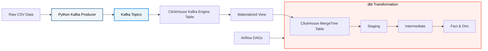

# Kafka Integration Plan: Streamify Data Pipeline

This document outlines the step-by-step milestones to integrate Kafka into the Streamify Data Pipeline project, transitioning from a batch-oriented process to a real-time streaming architecture. 

It also includes the exact code, SQL commands, and real-world Data Engineering debugging lessons we learned along the way!

## Overview of the Architecture



---

## Milestone 1: Kafka Environment Setup & Validation
**Goal:** Prepare the Docker infrastructure to run Kafka and Airflow with the correct Python dependencies.

**What we did:**
1. We removed the dynamic `_PIP_ADDITIONAL_REQUIREMENTS` from `docker-compose.yaml` (an anti-pattern).
2. We created a `requirements.txt` inside the `airflow/` folder and added `confluent-kafka`.
3. We updated the `airflow/Dockerfile` to `COPY requirements.txt` and run `pip install -r requirements.txt`.
4. We rebuilt the image and started the stack:
   ```bash
   docker compose up -d --build
   ```

**Lesson Learned:** Pre-baking dependencies into your Docker image using a `requirements.txt` makes startup significantly faster and prevents sudden crashes in production.

---

## Milestone 2: Build the Python Data Producer
**Goal:** Simulate a live upstream source by streaming CSV data row-by-row into Kafka.

**What we did:**
We created a Python script (`kafka/producer/kafka_producer.py`) and ran it inside the Airflow Docker container. 

**The Final Code:**
```python
import pandas as pd
import json
import time
import argparse
from confluent_kafka import Producer

def delivery_report(err, msg):
    if err is not None:
        print(f'Message delivery failed: {err}')
    else:
        print(f'Message delivered to {msg.topic()} [{msg.partition()}]')

def produce_from_csv(csv_filepath, topic, broker='kafka:29092'):
    conf = {'bootstrap.servers': broker}
    producer = Producer(conf)

    print(f"Reading data from {csv_filepath}...")
    
    chunksize = 100 
    for chunk in pd.read_csv(csv_filepath, chunksize=chunksize):
        
        # FIX 1: Format datetime correctly for ClickHouse (YYYY-MM-DD HH:MM:SS)
        chunk['ts'] = pd.to_datetime(chunk['ts']).dt.strftime('%Y-%m-%d %H:%M:%S')
        
        for index, row in chunk.iterrows():
            # FIX 2: Convert pandas NaN to None (so JSON parses it as 'null')
            record = {k: (None if pd.isna(v) else v) for k, v in row.to_dict().items()}
            
            json_data = json.dumps(record)
            producer.poll(0)
            producer.produce(topic=topic, value=json_data.encode('utf-8'), callback=delivery_report)
            time.sleep(0.05)
            
    producer.flush()
    print("Finished producing messages.")

if __name__ == '__main__':
    parser = argparse.ArgumentParser(description="Stream CSV data to Kafka")
    parser.add_argument('--file', required=True)
    parser.add_argument('--topic', required=True)
    parser.add_argument('--broker', default='kafka:29092')
    
    args = parser.parse_args()
    produce_from_csv(args.file, args.topic, args.broker)
```

**How to run it:**
```bash
docker compose exec airflow-worker python /opt/services/producer/kafka_producer.py --file /opt/data/listen_events.csv --topic streamify_listen_events_v2 --broker kafka:29092
```

---

## Milestone 3: Real-Time Ingestion into ClickHouse
**Goal:** Use ClickHouse's native Kafka Engine to ingest the streaming data automatically (replacing the manual Python ELT extraction script).

**What we did:**
We created the 3 necessary components inside ClickHouse.

**The SQL Commands:**
```sql
-- 1. Create the Permanent Storage Table
CREATE TABLE IF NOT EXISTS streamify_database.listen_events_raw (
    artist String, song String, duration Float64, ts DateTime,
    sessionid Nullable(Float64), auth String, level String,
    itemInSession UInt64, city String, zip Nullable(Float64),
    state String, userAgent String, lon Float64, lat Float64,
    userId UInt64, lastName String, firstName String, gender String,
    registration Float64, year UInt64, month UInt64, hour UInt64, day UInt64
) ENGINE = MergeTree()
ORDER BY (userId, ts);

-- 2. Create the Kafka Queue Listener
CREATE TABLE IF NOT EXISTS streamify_database.kafka_listen_events_queue (
    artist String, song String, duration Float64, ts DateTime,
    sessionid Nullable(Float64), auth String, level String,
    itemInSession UInt64, city String, zip Nullable(Float64),
    state String, userAgent String, lon Float64, lat Float64,
    userId UInt64, lastName String, firstName String, gender String,
    registration Float64, year UInt64, month UInt64, hour UInt64, day UInt64
) ENGINE = Kafka
SETTINGS
    kafka_broker_list = 'kafka:29092',
    kafka_topic_list = 'streamify_listen_events_v2',
    kafka_group_name = 'clickhouse_consumer',
    kafka_format = 'JSONEachRow';

-- 3. Create the Materialized View (The Glue)
CREATE MATERIALIZED VIEW IF NOT EXISTS streamify_database.mv_listen_events 
TO streamify_database.listen_events_raw AS
SELECT *
FROM streamify_database.kafka_listen_events_queue;
```

### Data Engineering Lessons & Debugging

During Milestone 3, we successfully debugged multiple real-world issues:

1. **The "Black Hole" View:** We realized the Materialized View was silently failing to create because of a typo in the database name (`streamify_databases` instead of `streamify_database`). We checked the `system.text_log` to diagnose this.
2. **Strict Schema Constraints:** ClickHouse's `JSONEachRow` parser crashes if data isn't perfectly formatted. We had to fix the Python script to output valid JSON `null` instead of `NaN`, and strip timezones from our ISO8601 timestamps so they matched the standard `DateTime` format.
3. **The "Poison Pill" Problem:** Even after fixing our Python script, ClickHouse wouldn't load the data. By querying `system.errors`, we discovered that the very first corrupted messages were stuck at the front of the queue (`offset: 0`). The ClickHouse consumer kept reading them, crashing, and looping infinitely. We bypassed this by pointing ClickHouse to a brand new, clean topic (`streamify_listen_events_v2`).

---
