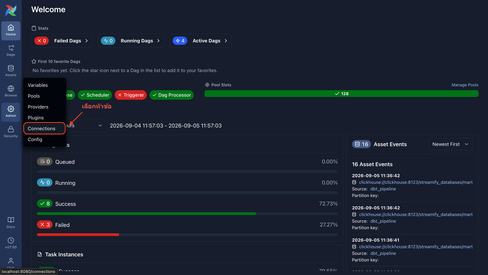
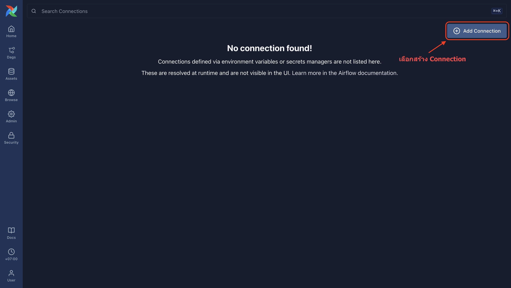
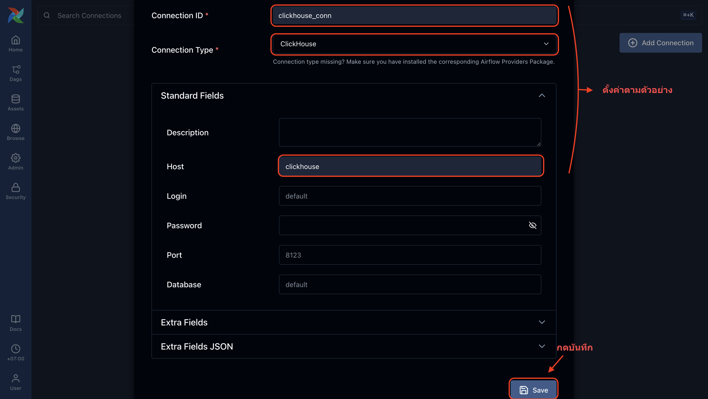
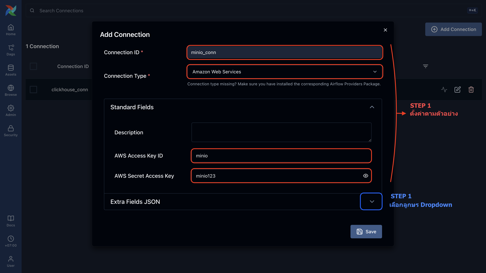
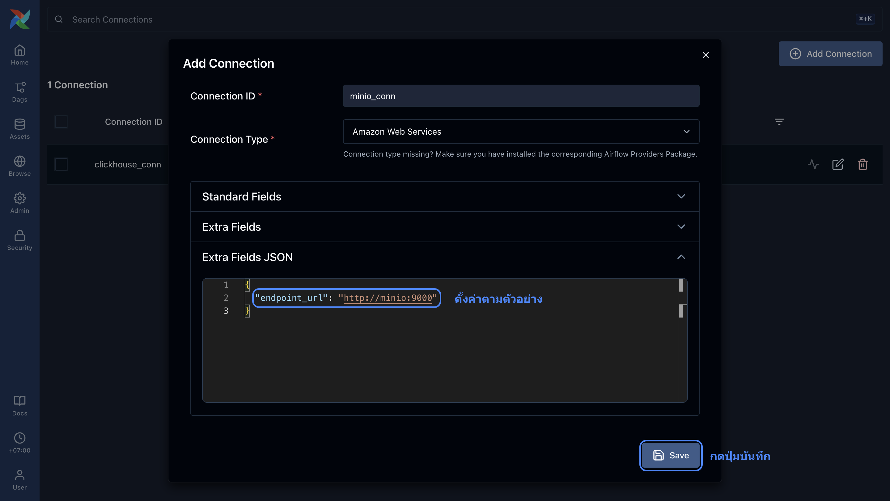

# Project Setup Guide

Follow these steps to set up the project locally:

## 1. Clone the repository
Clone the repository and switch to the `poc/streamify-pipeline` branch:
```bash
git clone https://github.com/IBoss47/data-pipeline-project.git
cd data-pipeline-project
git checkout poc/streamify-pipeline
```

## 2. Setup Environment Variables
Create a `.env` file in the project root with the following contents:

```env
# --- ClickHouse & Storage Config ---
CHVER=latest

# --- Airflow Core Config ---
AIRFLOW_UID=50000
_AIRFLOW_WWW_USER_USERNAME=airflow
_AIRFLOW_WWW_USER_PASSWORD=airflow
AIRFLOW__API_AUTH__JWT_SECRET=airflow_jwt_secret

# --- Database Credentials (Postgres for Airflow) ---
POSTGRES_USER=airflow
POSTGRES_PASSWORD=airflow
POSTGRES_DB=airflow

# --- MinIO Credentials ---
MINIO_ROOT_USER=minio
MINIO_ROOT_PASSWORD=minio123

# --- ClickHouse Credentials ---
CLICKHOUSE_USER=default
CLICKHOUSE_PASSWORD=
```

## 3. Setup Profiles
Create a `profiles.yml` file in the project's dbt directory at `/Users/iboss/workspace/data-pipeline-project/dbt/profiles.yml` and add the following `streamify` profile configuration:

```yaml
streamify:
  target: local

  outputs:

    local:
      type: clickhouse
      host: localhost
      port: 8123
      user: default
      password: ""
      schema: streamify_databases
      secure: false

    docker:
      type: clickhouse
      host: clickhouse
      port: 8123
      user: default
      password: ""
      schema: streamify_databases
      secure: false
```

## 4. Setup Variable Connection
Follow these steps to configure your variables and connections in the Airflow UI:

1. **Go to Connections**: From the Airflow UI, click on **Admin** > **Connections**.
   


2. **Add Connection**: Click the **+ Add Connection** button.
   


3. **Create ClickHouse Connection**: 
   Fill in the following details, then click Save:
   - **Connection ID**: `clickhouse_conn`
   - **Connection Type**: `ClickHouse`
   - **Host**: `clickhouse`
   - **Login**: `default`
   - **Port**: `8123`
   - **Database**: `default`
   


4. **Create MinIO Connection (Standard Fields)**:
   Click **+ Add Connection** again and fill in:
   - **Connection ID**: `minio_conn`
   - **Connection Type**: `Amazon Web Services`
   - **AWS Access Key ID**: `minio`
   - **AWS Secret Access Key**: `minio123`
   


5. **Create MinIO Connection (Extra Fields)**:
   Expand the **Extra Fields JSON** section and add the following JSON, then click Save:
   ```json
   {
     "endpoint_url": "http://minio:9000"
   }
   ```
   


## 5. Start Services
Run Docker Compose to start the project services in detached mode:
```bash
docker compose up -d
```

## 6. Access the Platforms
Once the services are running, you can access the platforms via your web browser:

- **Airflow Web UI**: [http://localhost:8080](http://localhost:8080)
  - **What it is for**: Manage, schedule, and monitor your data pipeline workflows (DAGs).
  - **Login**: Use the credentials defined in your `.env` file (Username: `airflow`, Password: `airflow`).

- **MinIO Console**: [http://localhost:9000](http://localhost:9000)
  - **What it is for**: Object storage interface (S3 compatible) to view and manage your files and buckets.
  - **Login**: Use the credentials defined in your `.env` file (Username: `minio`, Password: `minio123`).
